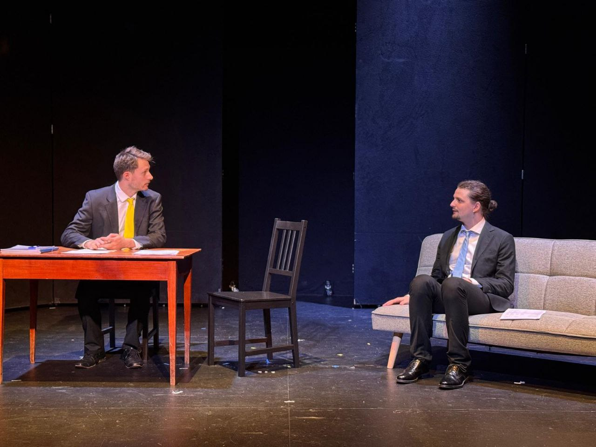
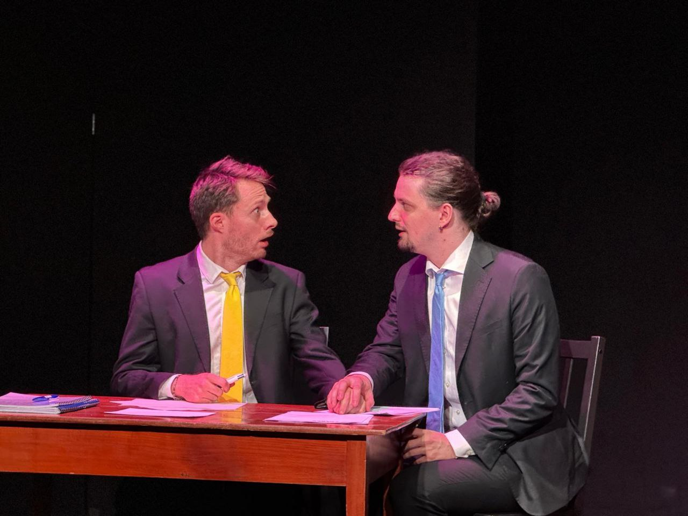
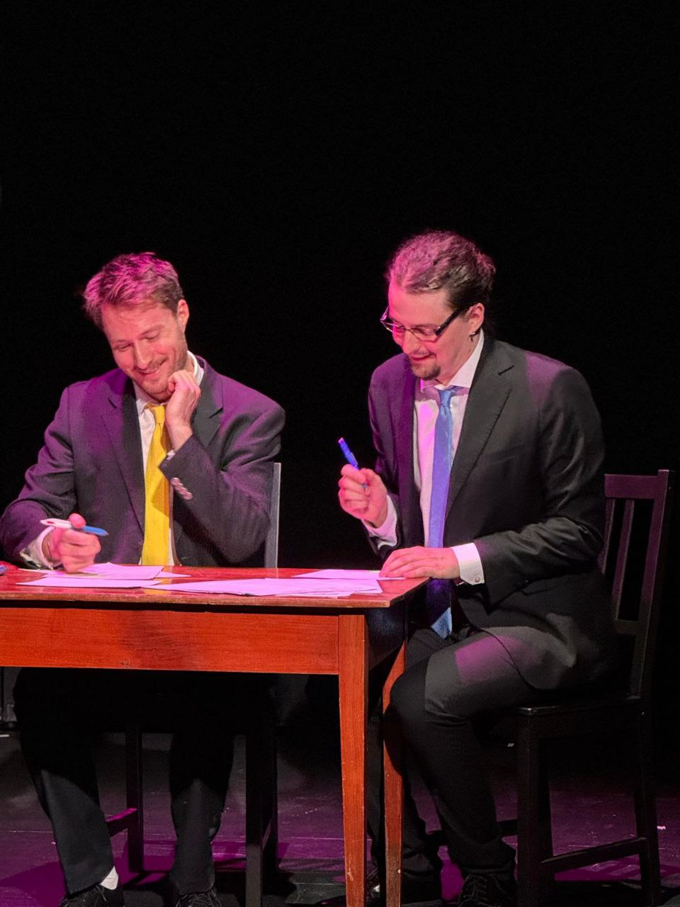

+++
date = '2025-07-05'
draft = false
title = '"Les trois Coups" Festival 2025'
+++

For the Acting Line end-of-the-year festival, called "Les trois Coups", I had the opportunity to play twice: for the "Acting in English" performance, and for the performance of the first year evening class.

For the english performance, I starred in a modified version of two scenes from "The Aliens", by Annie Baker, with two of my schoolmates: Khadin, for the amateur class, and Josquin Graf from the first year day class.

For the french performance, I played in two scenes.
The first one is a scene dear to me from the french TV show Kaamelott, book V part 6: the [dialog between the shepherdess and Arthur](https://youtu.be/-Dky6Hs2MZU?si=7BbUp3JVw0ruPWnY&t=2883) about the child he is looking for. I had the pleasure of sharing the stage with Morgane Matthey.
The second scene is a shortened version of "L'Épistole", by Jean-Michel Ribes. I had the joy of playing this scene I find hilarious with Daniel Girod.

I had a ton of fun, and I'm eager to play again next year!

*Credits photos&nbsp;: Olga G. Andreichikova, Acting Line Studio*

