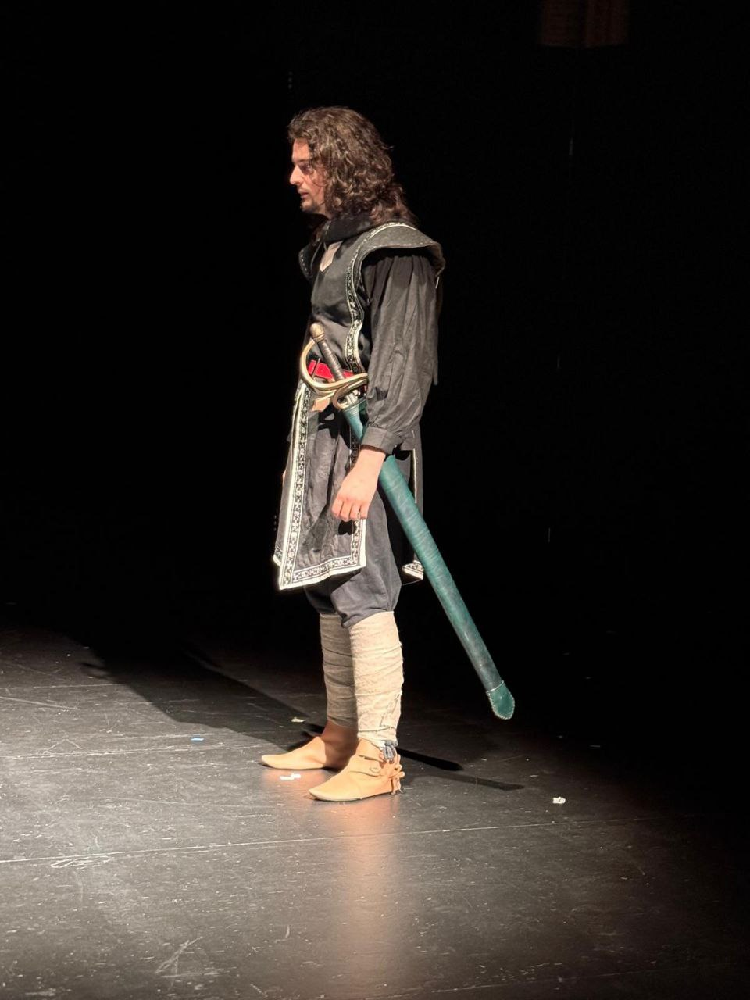
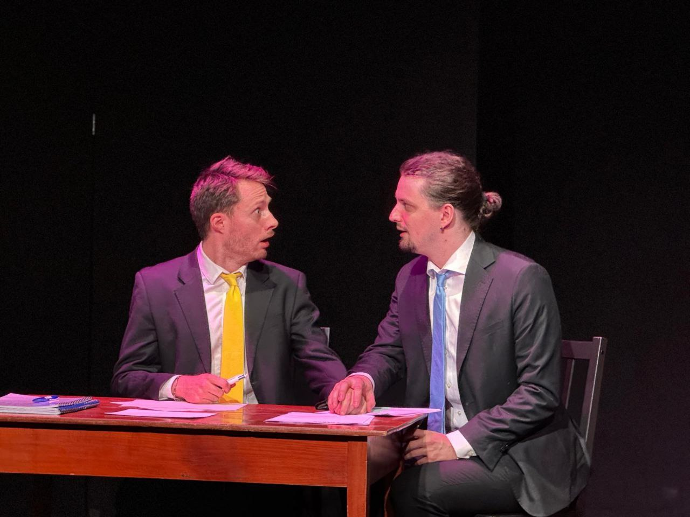
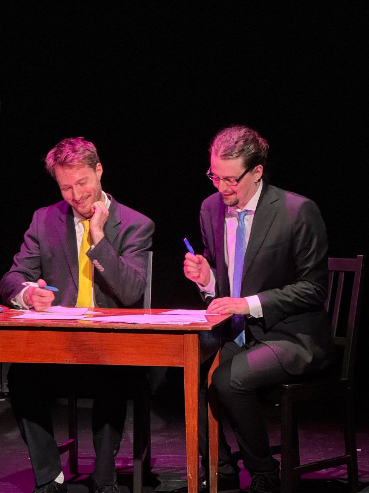

+++
date = '2025-07-05'
draft = false
title = 'Festival "Les trois Coups" 2025'
+++

À l'occasion du festival "Les trois Coups", festival de fin d'année d'Acting Line, j'ai pu monter sur scène à deux reprises&nbsp;: pour la représentation de la classe "Acting in English", et pour la représentation de la classe professionnelle de 1ère année du soir.

Pour la représentation en anglais, j'ai joué une version modifiée de deux scènes de "The Aliens", par Annie Baker, avec deux de mes camarades&nbsp;: Khadim de la classe amateur, et Josquin Graf de la première année professionnelle de jour.

Pour la représentation en français, j'ai participé à deux scènes.
La première est une scène qui me tient beaucoup à cœur qui provient de la série télévisée Kaamelott, livre V partie 6&nbsp;: le [dialogue de la bergère et d'Arthur](https://youtu.be/-Dky6Hs2MZU?si=7BbUp3JVw0ruPWnY&t=2883) au sujet de l'enfant qu'il recherche. J'ai eu le plaisir de partager cette scène avec Morgane Matthey.
La seconde est une version raccourcie de "L'Épistole" de Jean-Michel Ribes. J'ai eu la joie de pouvoir jouer cette scène que je trouve hilarante aux côtés de Daniel Girod.

Je me suis vraiment beaucoup amusé, et j'ai hâte de participer l'année prochaine&nbsp;!

*Crédits photos&nbsp;: Olga G. Andreichikova, Acting Line Studio*

